# SQL 

- SQL stands for Structures Query Language
- SQL is a relational database query language
- SQL is based in a tabular structure
- It allows you to access and manipulate databases
- Basic SQL commands include:
    - CREATE Creates a new table, a view of a table, or another object in the database.
    - ALTER	Modifies an existing database object, such as a table.
    - DROP Deletes an entire table, a view of a table or other objects in the database.
    - SELECT Retrieves certain records from one or more tables.
    - INSERT Creates a record.
    - UPDATE Modifies a record.
    - DELETE Deletes a record.
    - GRANT	Gives a privilege to users.
    - REVOKE Takes back privileges granted from users.
    

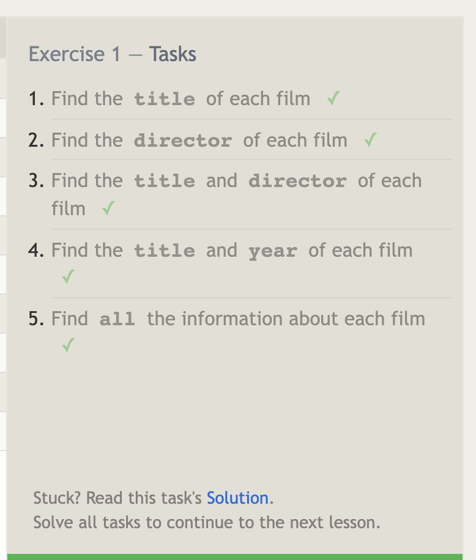
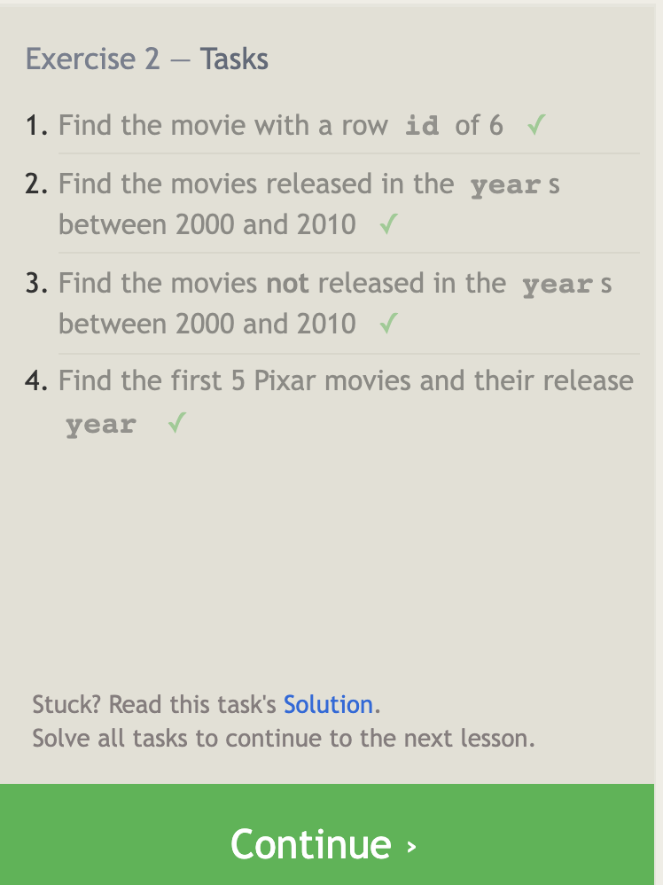
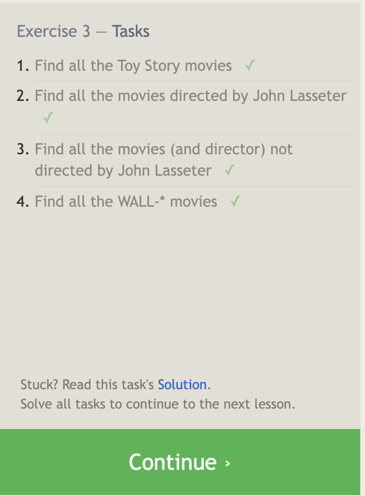
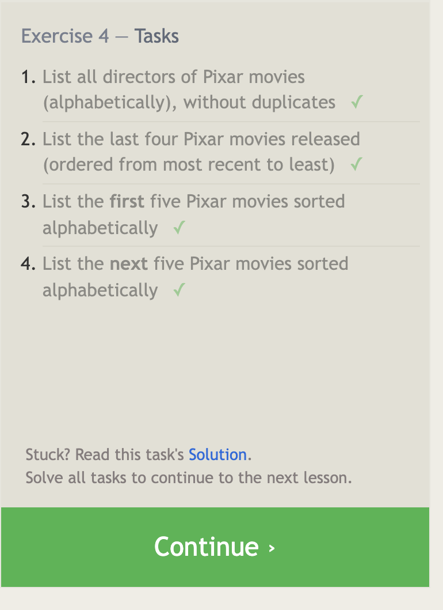
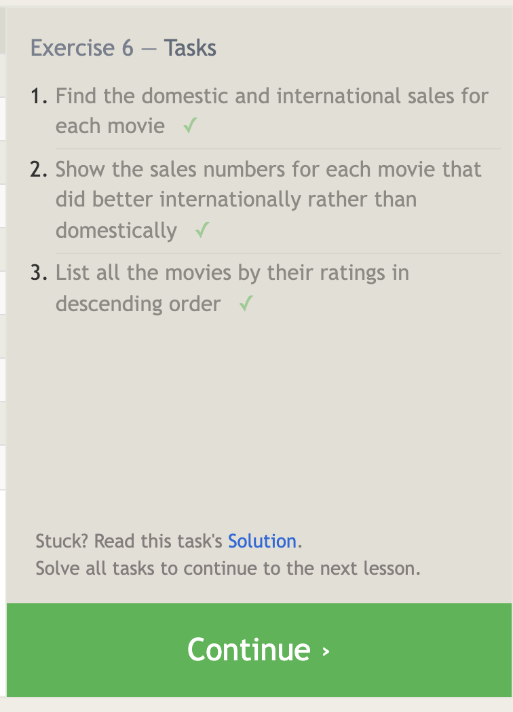
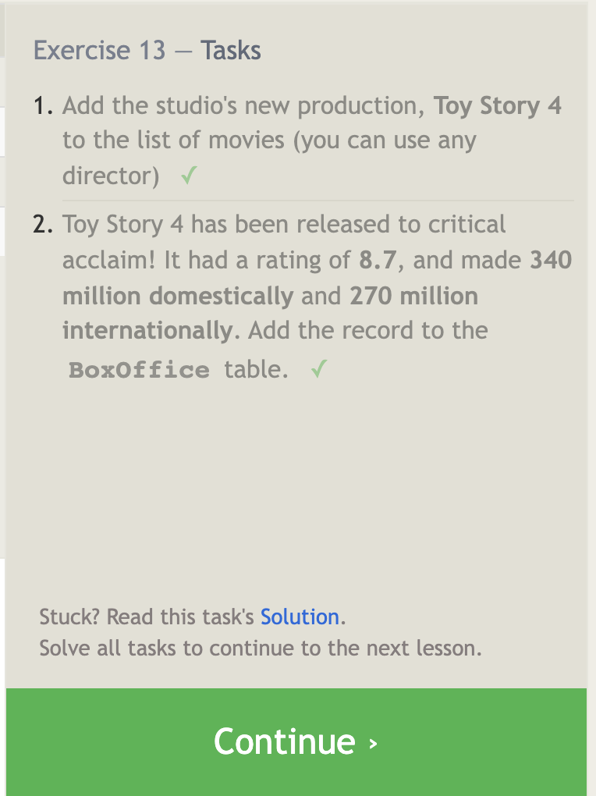
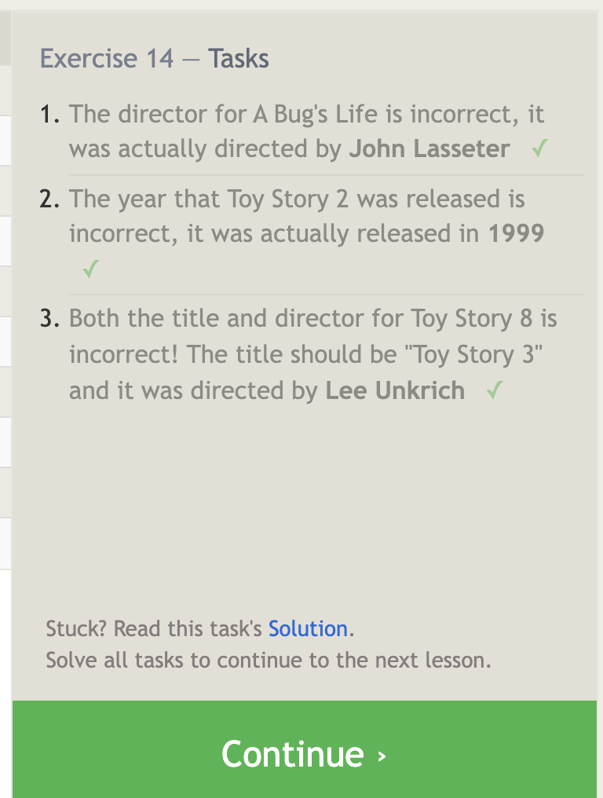
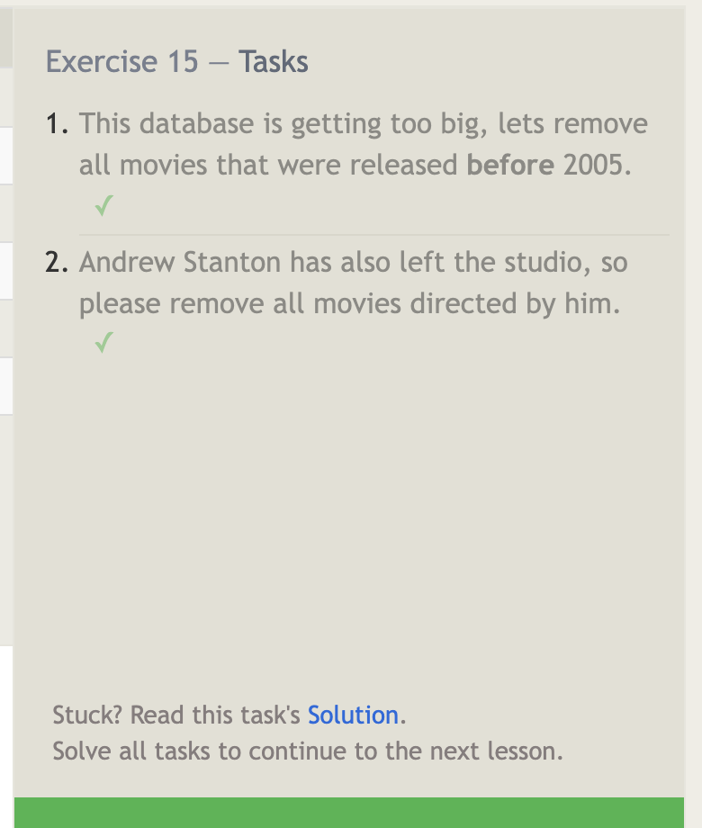
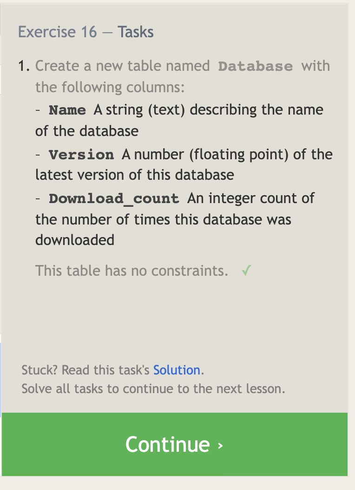
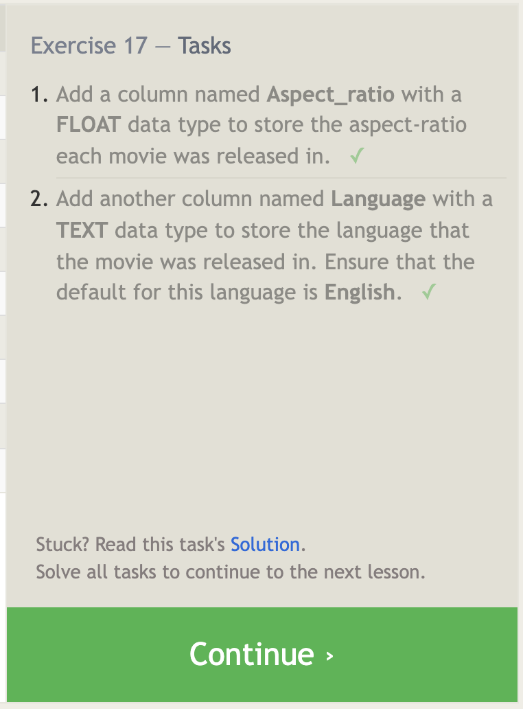
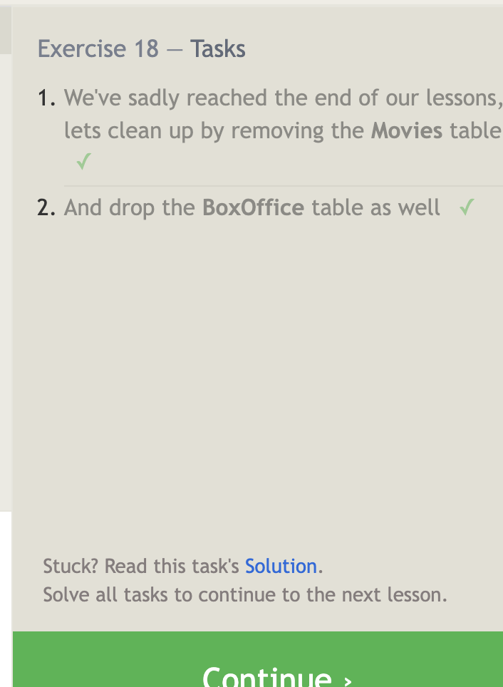
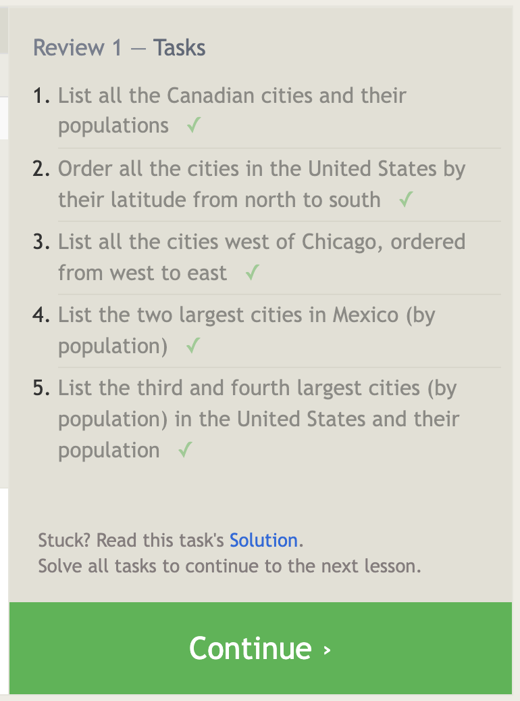